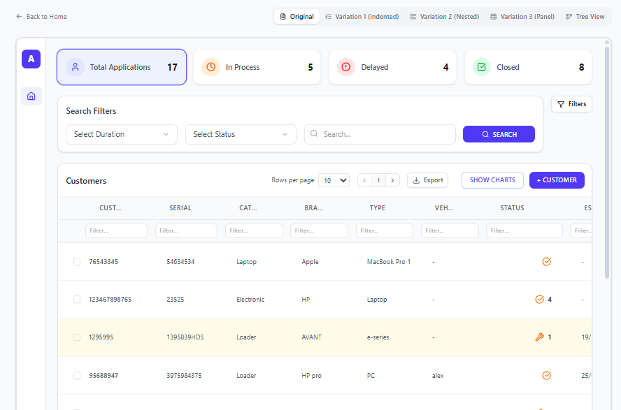
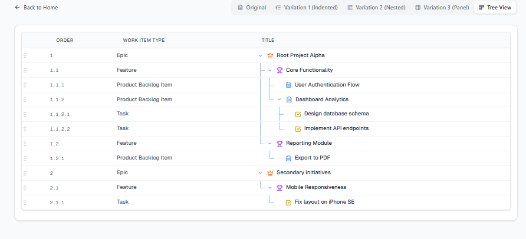
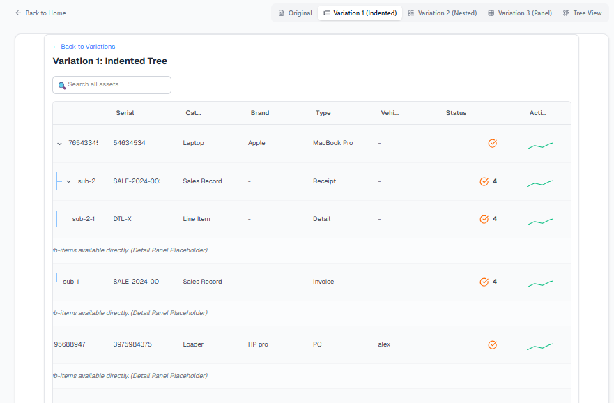
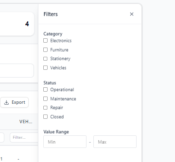
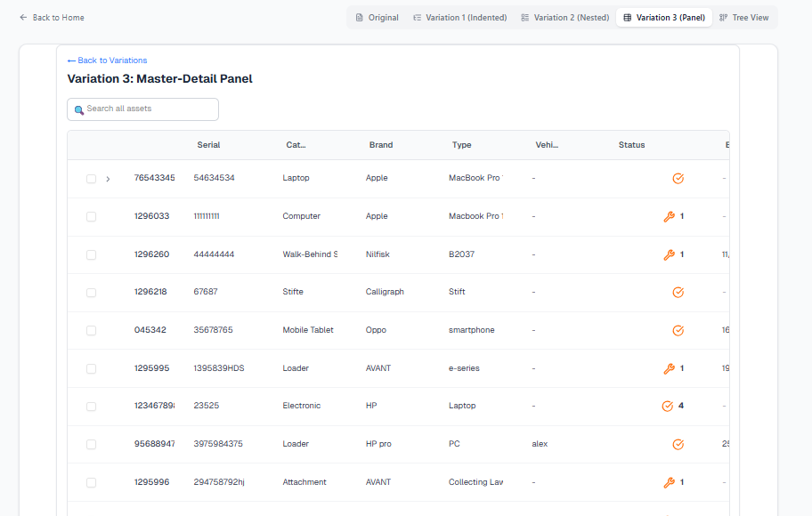

# Advanced Asset Management Grid

A powerful, high-performance data grid application built with **Next.js 14**, **Tailwind CSS**, and **TanStack Table**. This project demonstrates advanced table features including tree-grid structures, drag-and-drop column reordering, custom filtering, and a modular component architecture.

## 🚀 Features

-   **Modular Architecture**: Fully refactored codebase with distinct Header, Row, Cell, and Panel components.
-   **Advanced Tree Grid**: Support for nested sub-rows (tree view) with recursive indentation and visual guide lines (`TreeLines`).
-   **High Performance**: Virtualized rows (`useVirtualization`) for handling large datasets efficiently.
-   **Drag & Drop Ecosystem**:
    -   **Row Reordering**: Drag items to reorder using `@dnd-kit`.
    -   **Column Reordering**: Intuitive column drag-and-drop.
-   **Rich Cell Features**:
    -   **Sparklines**: Mini-charts (`CellSparkline`) embedded directly in cells.
    -   **Inline Editing**: Support for direct data manipulation within the grid.
    -   **Comments**: Hover-based annotation threads (`CellComments`).
-   **Comprehensive Toolbar**:
    -   **Global Search**: Fuzzy search across all levels.
    -   **Pivot Mode**: Toggle for aggregation views.
    -   **Export**: Built-in support for Excel/CSV/PDF export.
-   **Interactive Panels**:
    -   **Status Bar**: Real-time component showing selection summaries (Sum, Avg).
    -   **Filter Panel**: Advanced sidebar filtering options.
    -   **Summary Cards**: Quick-access KPI cards for data filtering.
-   **Visual Variants**: Multiple table variations including Master-Detail and Pinned Rows.

## 📂 Component Structure

The project follows a strict modular structure for the `AssetTable`:

```text
components/AssetTable/
├── components/
│   ├── Cell/       # Cell renderers (Sparkline, Editor, Expander)
│   ├── Header/     # Column headers, filtering, resizing
│   ├── Modals/     # Add Item, Chart Modals
│   ├── Panels/     # Sidebar, FilterPanel, StatusBar
│   ├── Row/        # Row logic, TreeLines, Pinned Rows
│   └── Toolbar/    # Search, Export, View Toggles
├── hooks/          # Custom hooks (useTableEngine, useVirtualization)
└── utils/          # Data transformation and helpers
```

## 🛠️ Tech Stack

-   **Framework**: Next.js 14 (App Router)
-   **Styling**: Tailwind CSS
-   **Table Logic**: TanStack Table v8
-   **Icons**: Lucide React
-   **Drag & Drop**: dnd-kit
-   **Language**: TypeScript

## 📸 Screenshots

### 1. Main Grid View
*Overview of the main Asset Table with tree structure.*


### 2. Tree Guide Lines
*Visual guide lines showing hierarchical relationships.*


### 3. Sparklines & Rich Cells
*Embedded charts and interactive cell components.*


### 4. Filter Panel & Sidebar
*Advanced filtering controls and sidebar navigation.*


### 5. Column Management
*Column reordering and visibility controls.*


## 📦 Getting Started

1.  **Clone the repository**:
    ```bash
    git clone https://github.com/AbdullahPro784/Task-25-tree-view
    cd Task-25-tree-view
    ```

2.  **Install dependencies**:
    ```bash
    npm install
    ```

3.  **Run the development server**:
    ```bash
    npm run dev
    ```

4.  Open [http://localhost:3000](http://localhost:3000) with your browser.

## 📄 License

This project is licensed under the MIT License.
