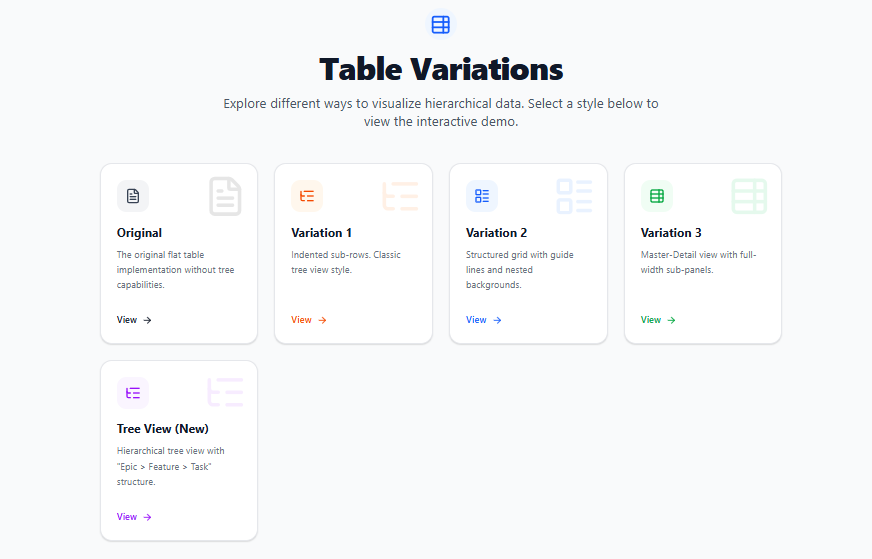
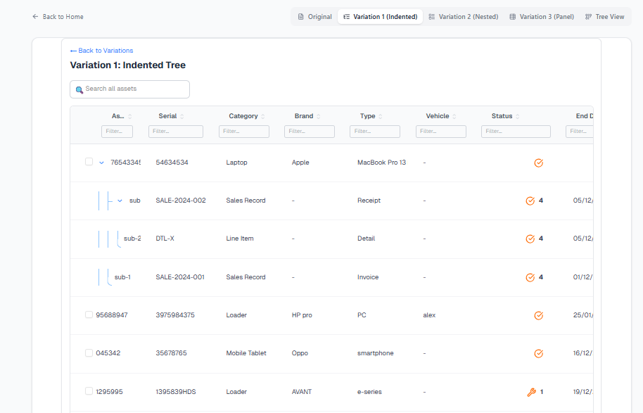
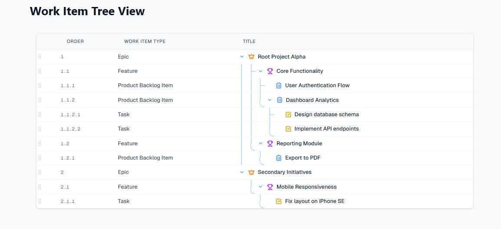
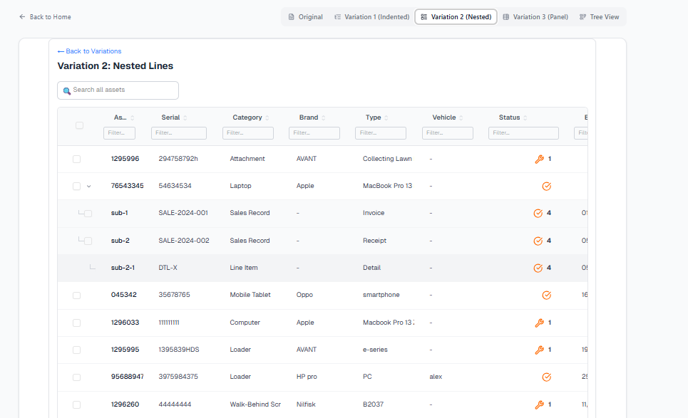
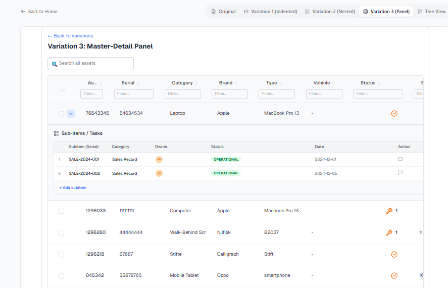
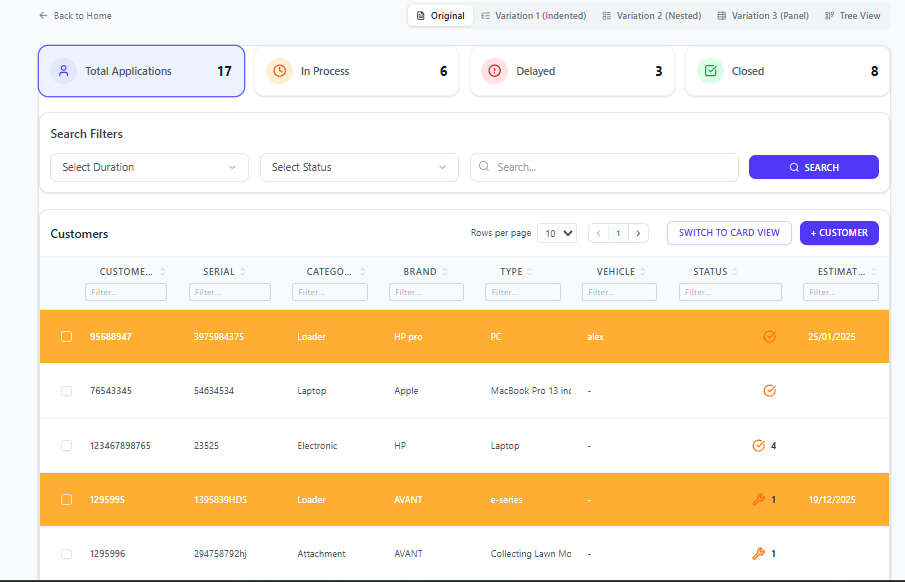

# Advanced Asset Management Grid

A powerful, high-performance data grid application built with **Next.js 14**, **Tailwind CSS**, and **TanStack Table**. This project demonstrates advanced table features including tree-grid structures, drag-and-drop column reordering, custom filtering, and multiple visualization variants.

## 🚀 Features

-   **Advanced Data Grid**: Built on TanStack Table for headless, performant state management.
-   **Tree Grid & Grouping**: Support for nested sub-rows (tree view) to display hierarchical asset data.
-   **Drag & Drop Ecosystem**:
    -   **Reorder Sorting**: Drag items between rows to reorder them; numbering (e.g., 1.1, 1.2) updates automatically.
    -   **Smart Grouping**: Drag an item **onto** another to create a new Group node containing both items.
    -   **Column Reordering**: Intuitive column drag-and-drop using `@dnd-kit`.
-   **Visual Guides**: Clear, continuous blue indentation lines for tracking complex hierarchies.
-   **Sub-item Management**: easily add, edit, and organize sub-tasks directly within the grid.
-   **Advanced Filtering**:
    -   **Summary Cards**: Filter by status (In Process, Delayed, Closed) with one click.
    -   **Global Search**: Real-time text search across all columns.
    -   **Status & Duration**: Dedicated dropdown filters for precise data slicing.
-   **Data Persistence**: Automatically saves data, column order, and layout preferences to `LocalStorage`.
-   **Multiple Visual Variants**:
    -   **Original**: Classic flat/tree table.
    -   **Variation 1**: Indented tree view.
    -   **Variation 2**: Nested grid with guide lines.
    -   **Variation 3**: Master-Detail panel view.
    -   **Tree View**: Dedicated, highly visual hierarchical view with advanced spacing and connectors.
-   **Editable Cells**: Inline editing capabilities for quick data updates.
-   **Smart Status Logic**: Automatically highlights overdue items and visualizes status states.

## 🛠️ Tech Stack

-   **Framework**: Next.js 14 (App Router)
-   **Styling**: Tailwind CSS
-   **Table Logic**: TanStack Table v8
-   **Icons**: Lucide React
-   **Drag & Drop**: dnd-kit
-   **Language**: TypeScript

## 📸 Previews

### 1. Landing Page & Variation Selection
Choose between different table visualizations to best suit your data needs.


### 2. Variation 1: Classic Tree View
Standard indented hierarchy for clear parent-child relationships.


### 3. Tree View (New)
Advanced hierarchical view with continuous visual guides and smart grouping capabilities.


### 4. Variation 2: Nested Grid
Structured grid layout with visual guides for deep nesting.


### 5. Variation 3: Master-Detail Panels
Full-width sub-panels for expanding detailed asset information.


### 6. Original Variant with Advanced Filters
The core implementation featuring the new **Summary Cards**, **Search Filter Bar**, and **Pagination**.


## 📦 Getting Started

1.  **Clone the repository**:
    ```bash
    git clone https://github.com/AbdullahPro784/Task-25-tree-view
    cd Task-25-tree-view
    ```

2.  **Install dependencies**:
    ```bash
    npm install
    ```

3.  **Run the development server**:
    ```bash
    npm run dev
    ```

4.  Open [http://localhost:3000](http://localhost:3000) with your browser.

## 📄 License

This project is licensed under the MIT License.
